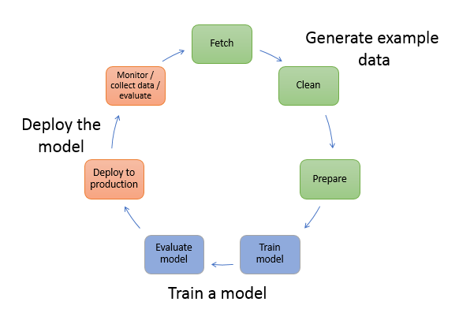
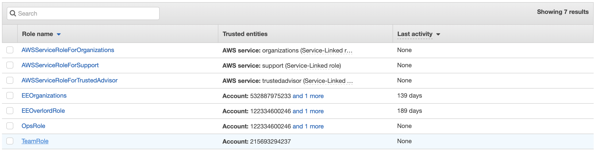
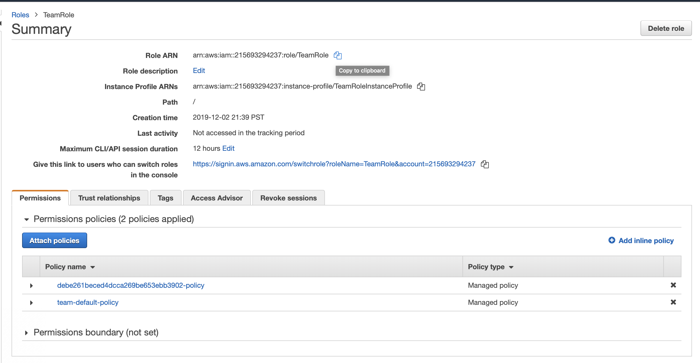

# AIM402 Deep learning with PyTorch

## Build, Test, and Tune Machine Learning Models with PyTorch & Amazon SageMaker


PyTorch is a deep learning framework that is becoming popular especially for 
rapid prototyping of new models. You can get started easily with PyTorch 
using Amazon SageMaker, a fully managed service to build, train, and deploy machine learning models at scale. 
In this workshop, we build a few natural language processing models to analyze & generate text. 

NLP solutions based on PyTroch have several principle components, text preprocessing, text representation using techniques such 
as GloVe: Global Vectors for Word Representation, state of the art general purpose, pre-trained models such as 
Bidirectional Encoder Representations from Transformers or BERT. 

In addition to these principle components, we need to plan for a full end-to-end model training and deployment lifecycle. 

This set of labs aim to enable to develop end-to-end NLP solutions with [PyTorch](pytorch.org) using  [Amazon SageMaker](https://aws.amazon.com/sagemaker/) 
for the full Machine Learning Lifecycle. Each lab is independent, but during the presentation we would go sequentially. 
We wish to thank the authors and code committers of projects listed in the reference section, the labs would not be possible without this 
excellent material. 

Pull requests for improvements and additions most welcome.    

### Event Engine for Labs

We are using event engine to setup the infrastructure needed for our labs today, so please follow the instructions to get setup with 
Event Engine first and then come back to this repo.


   
### To run this workshop locally on your laptop -

```bash
$ cd src
$ ./boot.sh
$ source venv/bin/activate
``` 


## Note on Notebooks

If asked to select a kernel - please select - conda_pytorch_36 everytime.

 

## Lab 1

In lab 1 we exercise all the various components of SageMaker that have native Pytorch support.
We start with a notebook that has a PyTorch kernel. Then we use sagemaker.pytorch.estimator.PyTorch to train 
a multi-layer LSTM RNN model. This model predicts the probability of the next word in the sequence, based on the words 
already observed in the sequence. We later in the notebook use this trained model to generate a legible text from
a random seed. At each stage of the model we use SageMaker to train, create model and finally deploy 
the model as a real time endpoint. 


## Lab 2 

In lab 2 we use SageMaker to fine tune Hugging Face's pre-trained BERT based on PyTorch. We use FastBert framework for this, we fine-tune
BERT for multi-class classification of comments. This lab is based on a Kaggle competition that is aimed at 
automatically labelling comments to be in one or more of the six possible types of comments - 
toxic, severetoxic, obscene, threat, insult, identityhate. 

We start off with first create a container, use SageMaker to train this container on a corpus of comments data.
Finally we deploy a real time endpoint and run it on a set of comments. 

## Lab 3

TBD 

## Lab 4

In lab 4 we work with newly released Captum.ai. In this lab we load a CNN model that has been pre-trained on IMDB dataset 
for sentiment analysis. Then we use this model to detect sentiments of each statement before using the integrated 
gradients method to interpret those predictions. 


## Steps for launching the workshop environment using EVENT ENGINE

Note: these steps were tested on Safari browser using Mac OS

Open a browser and navigate to https://dashboard.eventengine.run/login

Enter a 12-character "hash" provided to you by workshop organizer.

Click on "Accpet Terms & Login"


Click on "AWS Console"


Please, log off from any other AWS accounts you are currently logged into

Click on "Open AWS Console"


You should see a screen like this.

We now need select the correct Identity Role for the workshop type "IAM" into the search bar and click on IAM.


Click on "Roles"


Scroll down past "Create Role" and Click on "TeamRole".



Copy "Role ARN" by selecting the copy icon on the right.

You may want to temporarily paste this role ARN into a notepad.

Once you copied TeamRole ARN, click on "Services" in the upper left corner.



Enter "SageMaker" in the search bar and click on it


You should see a screen like this.

Click on the orange button "Create Notebook Instance".


On the next webpage,
- Give your notebook a name (no underscores, please).
- Under Notebook instance type, select "ml.p2.xlarge".
- Under "Permission and encryption" select "Enter a custom IAM role ARN".
- Paste your TeamRole ARN in the cell below labeled "Custom IAM role ARN".
Note: your TeamRole ARN will have different AWS account number than what you see here.
- Scroll down to the bottom of the page and click on "Create Notebook instance".


You should see your notebook being created. In a couple of minutes, its status will change from "Pending" to "In Service", at which point, please click on "Open Jupyter".


In Jupyter Lab console, please, open 'Terminal'.


A new tab will open displaying a command prompt terminal.

In the terminal tap, please, issue these two commands:

$ cd SageMaker
$ git clone https://github.com/C24IO/Reinvent2019Pytorch.git

You should see output similar to this:


You may now navigate to the lab notebooks and get started, best of luck :-) ! 


## Extras

We have and will continue to add a few extras to this set of labs. *bonus* is a directory that contains some helper scripts. 
We have also included an alternative way to solve the toxic comments 
classification challenge using the [The fastai deep learning library](https://github.com/fastai/fastai).
Also - the folder *impatient* contains the solved labs with outputs.


## References & Source Material
* [SageMaker Examples](https://github.com/awslabs/amazon-sagemaker-examples)
* [Introducing FastBert — A simple Deep Learning library for BERT Models](https://medium.com/huggingface/introducing-fastbert-a-simple-deep-learning-library-for-bert-models-89ff763ad384)
* [Kaushal Trivedi's FastBert](https://github.com/kaushaltrivedi/fast-bert)
* [🤗 Hugging Face - Solving NLP, one commit at a time!](https://github.com/huggingface)
* [GloVe: Global Vectors for Word Representation](https://nlp.stanford.edu/projects/glove/)
* [Kaggle Competetion - Toxic Comment Classification Challenge](https://www.kaggle.com/c/jigsaw-toxic-comment-classification-challenge)
* [Jeffrey Hsu, Susannah Klanecek: A Deep Dive into NLP with PyTorch | PyData London 2019](https://www.youtube.com/watch?v=Apx_1erbQB4)
* [A Deep Dive into NLP with PyTorch](https://github.com/scoutbee/pytorch-nlp-notebooks)
* [A Deep Dive into NLP with PyTorch - Slides](https://docs.google.com/presentation/d/1zyuwCx7knqnP-LJswlDfWSmk5FhFgFmYJGqdEZn8yhc/edit#slide=id.g33c734b530_0_656)
* [Captum - Interpreting text models: IMDB sentiment analysis](https://captum.ai/tutorials/IMDB_TorchText_Interpret)
* [Ben Trevett's - PyTorch Sentiment Analysis](https://github.com/bentrevett/pytorch-sentiment-analysis)
* [Large Movie Review Dataset](https://ai.stanford.edu/~amaas/data/sentiment/)
* [Nikita Sharma's Python notebook using data from Toxic Comment Classification Challenge](https://www.kaggle.com/nikkisharma536/fastai-toxic)
* [Nikita Sharma's blog - Deep Learning on multi-label text classification with FastAi](https://medium.com/@nikkisharma536/deep-learning-on-multi-label-text-classification-with-fastai-d5495d66ed88)
* [SageMaker PyTorch Container](https://github.com/aws/sagemaker-pytorch-container) 
* [SageMaker PyTorch Estimators and Models](https://github.com/aws/sagemaker-python-sdk/tree/f14d86ca3abae405c16daf124e1920018c319683/src/sagemaker/pytorch#pytorch-estimators)
* [Amazon SageMaker Workshop about Using Custom Algorithms](https://sagemaker-workshop.com/custom.html) 
* [An ImageNet for language](https://thegradient.pub/nlp-imagenet/)


