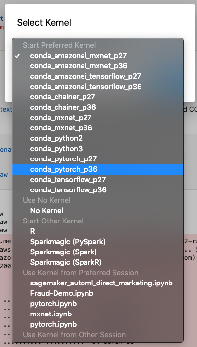

## Background

This example trains a multi-layer LSTM RNN model on a language modeling task based on [PyTorch example](https://github.com/pytorch/examples/tree/master/word_language_model). By default, the training script uses the Wikitext-2 dataset. We will train a model on SageMaker, deploy it, and then use deployed model to generate new text.

For more information about the PyTorch in SageMaker, please visit [sagemaker-pytorch-containers](https://github.com/aws/sagemaker-pytorch-containers) and [sagemaker-python-sdk](https://github.com/aws/sagemaker-python-sdk) github repositories.

## Setup

Select the correct kernel while launching the notebook

